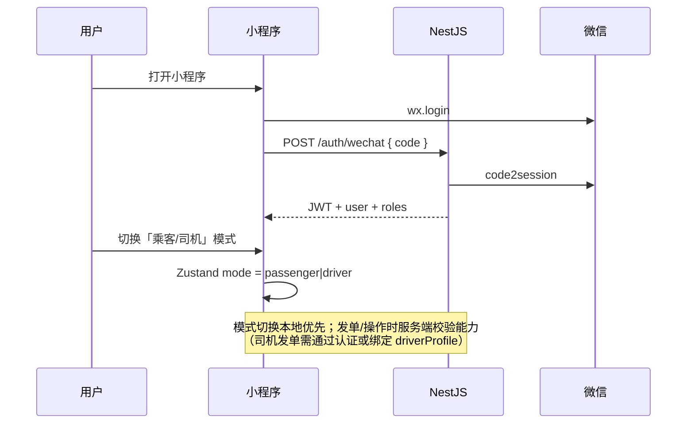
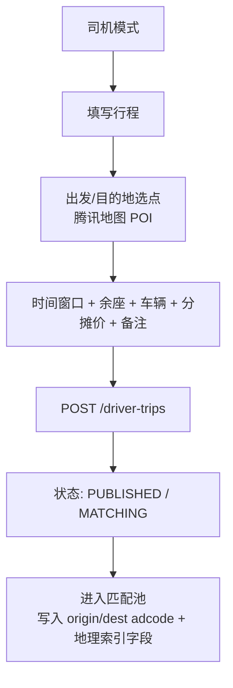
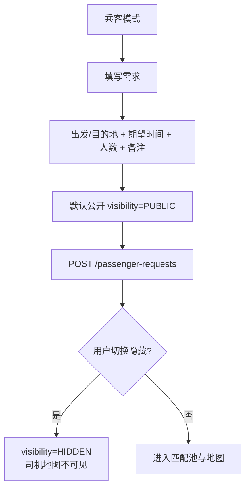
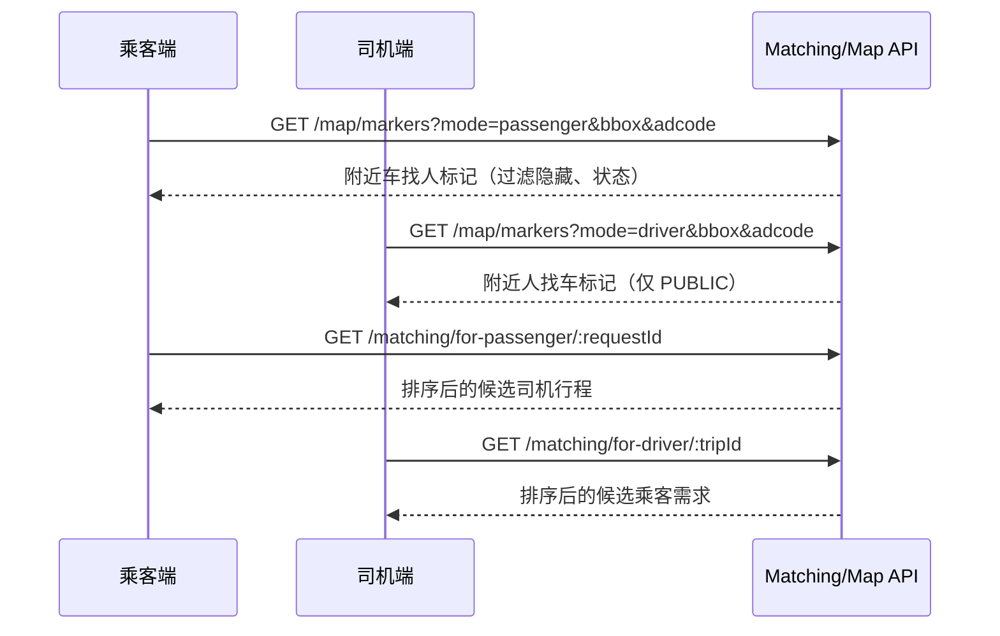
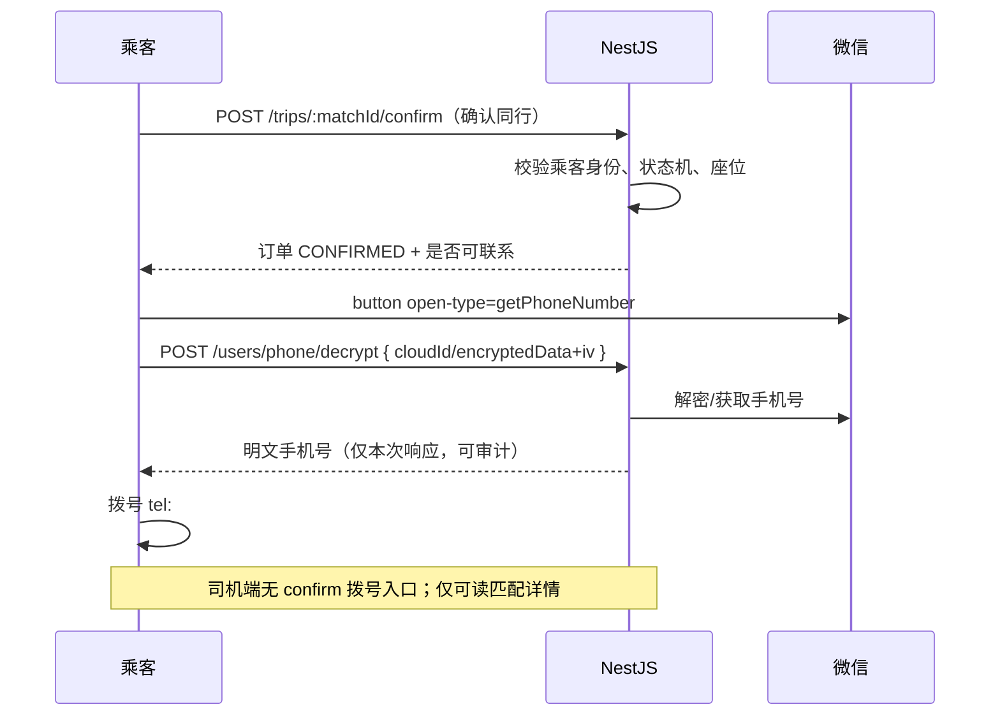
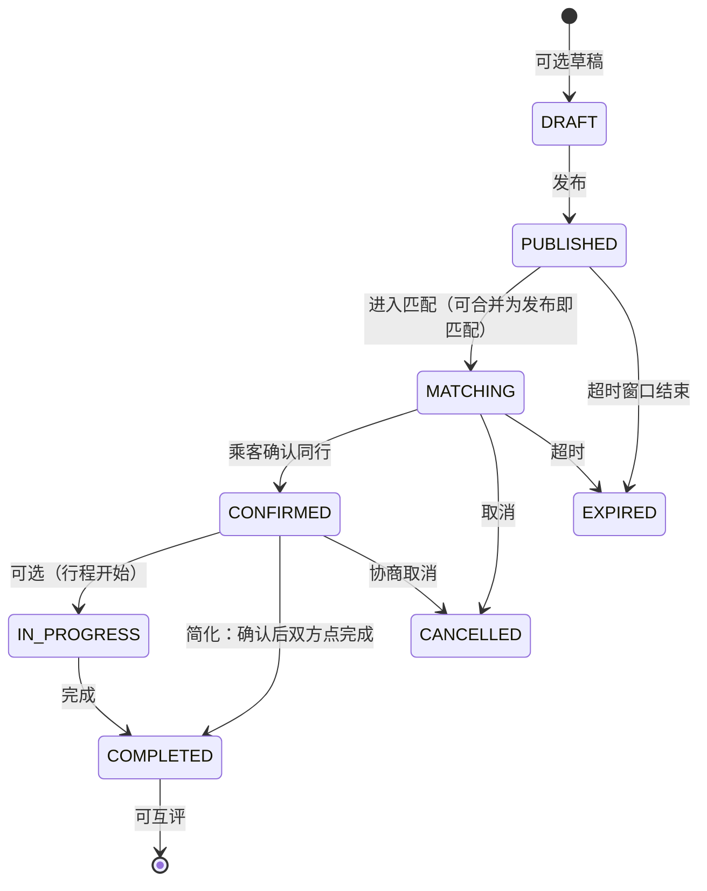
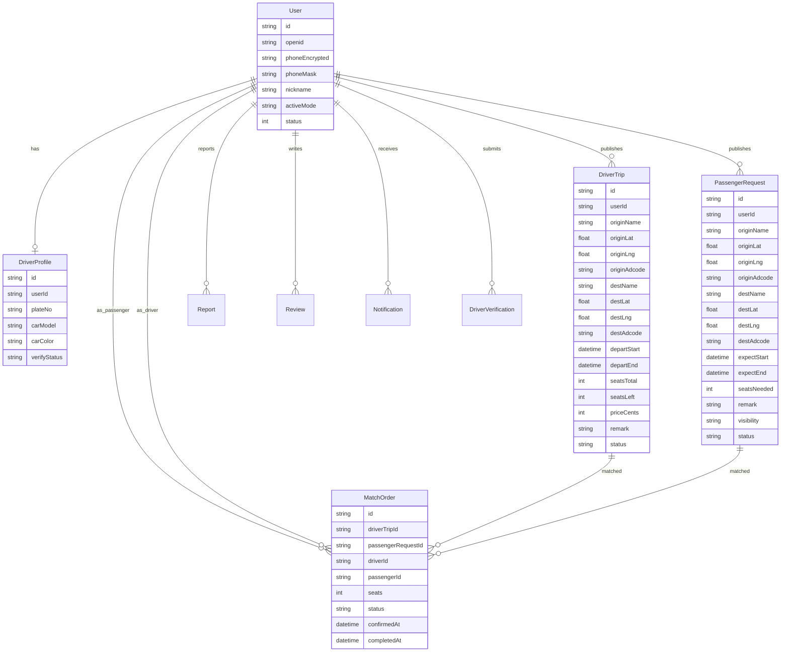
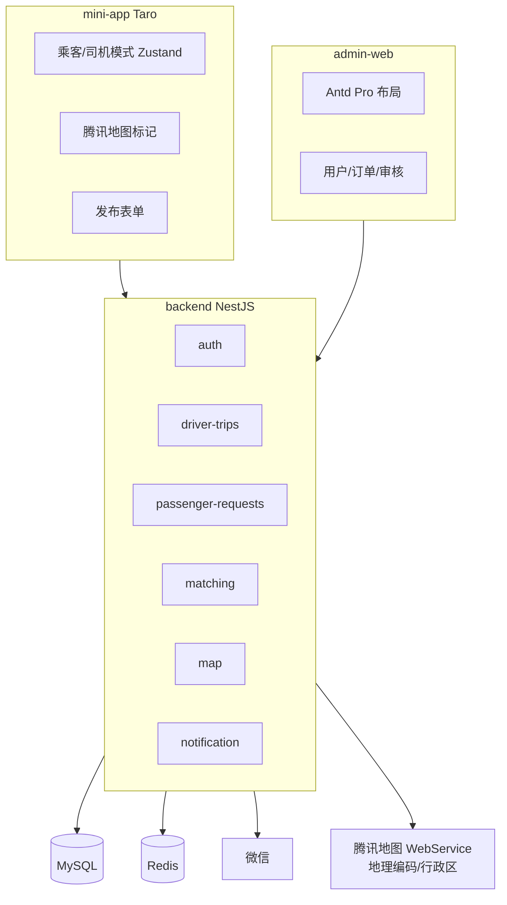

# egofind 产品设计文档 + 数据模型

> **角色**：**长设计基线**（定位、原则、主流程、匹配算法、模型纲要）。  
> **短真相 / 当前切片**：[`requirements.md`](./requirements.md) · **文档地图**：[`README.md`](./README.md)  
> **域规则合集**：[`domain-rules.md`](./domain-rules.md)（额度、adcode）  
> **实现表结构**：[`database.md`](./database.md) + `backend/prisma/schema.prisma`  
> **产品名**：egofind（EGoFind / Yi Go Find）— 同城/县域顺风车 **双向匹配**  
> **说明**：文内「第1步」等历史口吻可忽略；以当前代码与 requirements Active slice 为准。
---

## 1. 产品定位

### 1.1 一句话

在 **同一县城/市区（adcode）** 内，让「车找人」的司机与「人找车」的乘客通过地图与规则匹配发现彼此，**乘客确认同行后**方可获取授权手机号联系，降低陌生人拼车的安全与骚扰风险。

### 1.2 目标用户

| 角色 | 场景 | 核心诉求 |
| --- | --- | --- |
| 乘客 | 县域通勤、赶集、跨镇短途 | 快速找到顺路车、控制人数与时间、电话联系前可评估 |
| 司机 | 固定路线有空位、分摊油费 | 发布路线与余座、被乘客发现、减少无效骚扰电话 |
| 管理员 | 运营与合规 | 审核司机认证、处理举报、区县数据统计 |

### 1.3 产品原则

1. **单小程序双模式**：同一账号可在「乘客 / 司机」间切换，模式只影响 UI 与可执行操作，不强制拆 App。  
2. **联系权非对称**：**仅乘客**可「确认同行」并拨打授权电话；司机只能查看匹配信息，不可主动拨号。  
3. **可见性可控**：乘客单可「公开 / 隐藏」；隐藏后不出现在司机端地图与匹配列表。  
4. **匹配分层**：先 **同 adcode（县城/市区）**，再 **时间重叠 + 距离 + 方向相似度**。  
5. **安全默认**：电话需微信授权 + 后端解密；举报、互评、订单生命周期齐全。  
6. **合规边界**：定位为 **顺风车/成本分摊信息撮合**，非巡游网约车；不承诺运输承运责任（文案与协议需明示）。

### 1.4 非目标（MVP 不做）

- 在线支付 / 分账结算（仅展示「同行车价-成本分摊」信息）  
- 实时轨迹跟车、司乘 IM  
- 跨城长途专线、多日行程编排  
- 自动派单强制成交  
- 原生 iOS/Android App  

---

## 2. 核心用户流程

### 2.1 登录与双角色切换



**角色说明**：

| 概念 | 含义 |
| --- | --- |
| 账号角色（RBAC） | `user`（默认）、`driver`（通过认证后授予）、`admin`（后台） |
| UI 模式 | `passenger` / `driver`，任意登录用户可切；司机专属能力依赖 `driver` 角色或认证状态 |

### 2.2 司机发布「车找人」



### 2.3 乘客发布「人找车」



### 2.4 匹配与地图发现



### 2.5 确认同行与电话（非对称）



### 2.6 订单生命周期



**MVP 简化状态（实现采用）**：

| 状态 | 说明 |
| --- | --- |
| `PUBLISHED` | 已发布，对匹配池可见（乘客单还受 visibility 约束） |
| `MATCHING` | 有候选或持续可匹配（可与 PUBLISHED 等价，字段保留便于扩展） |
| `CONFIRMED` | 乘客已确认同行，座位扣减，电话通道对乘客开放 |
| `COMPLETED` | 行程结束，可互评 |
| `CANCELLED` | 取消 |
| `EXPIRED` | 时间窗结束未确认 |

---

## 3. 功能清单

### 3.1 小程序（用户端）

| 模块 | 功能 | 优先级 |
| --- | --- | --- |
| 登录 | 微信登录、JWT 持久化 | P0 |
| 双模式 | 顶栏切换乘客/司机 | P0 |
| 司机发布 | 车找人表单 + 地图选点 | P0 |
| 乘客发布 | 人找车表单 + 公开/隐藏 | P0 |
| 地图 | 标记（不同图标）、点击详情、视野内拉取 | P0 |
| 列表 | 我的发布、匹配候选列表 | P0 |
| 确认同行 | 仅乘客 | P0 |
| 手机号 | getPhoneNumber + 后端解密 + 拨号 | P0 |
| 举报 | 对用户/订单提交原因 | P0 |
| 评价 | 完成后互评（星级+标签+文字） | P1 |
| 消息 | 站内通知列表（确认/取消） | P1 |
| 司机认证 | 提交证件信息待审 | P0 |

### 3.2 管理后台

| 模块 | 功能 | 优先级 |
| --- | --- | --- |
| 登录 | 管理员账号密码 + JWT | P0 |
| 用户管理 | 列表、禁用、角色、详情 | P0 |
| 订单管理 | 司机行程/乘客需求/匹配单筛选 | P0 |
| 内容审核 | 备注敏感、举报处理 | P0 |
| 司机认证审核 | 通过/驳回 → 授予 driver 角色 | P0 |
| 统计 | 按区县 adcode 订单量、匹配率、用户数 | P1 |
| 地图预览 | 后台查看某 adcode 供需点 | P1 |

### 3.3 后端模块

| 模块 | 路径建议 | 职责 |
| --- | --- | --- |
| auth | `/auth/*` | 微信登录、管理员登录、JWT |
| users | `/users/*` | 资料、手机号解密、模式偏好 |
| driver-trips | `/driver-trips/*` | 车找人 CRUD + 状态 |
| passenger-requests | `/passenger-requests/*` | 人找车 CRUD + 可见性 |
| matching | `/matching/*` | 候选列表、评分排序、确认同行 |
| map | `/map/*` | 视野标记聚合/列表 |
| notification | `/notifications/*` | 站内通知 |
| reports | `/reports/*` | 举报 |
| reviews | `/reviews/*` | 互评 |
| driver-verify | `/driver-verifications/*` | 司机认证 |
| admin | `/admin/*` | 后台聚合接口（可复用模块 + RBAC） |

---

## 4. 匹配算法细节

### 4.1 输入

- **锚点实体**：司机行程 `DriverTrip` 或 乘客需求 `PassengerRequest`  
- **候选池**：状态 ∈ {PUBLISHED, MATCHING}，未过期，乘客单 `visibility=PUBLIC`（对司机可见时）  
- **查询者 adcode**：优先使用出发地 `originAdcode` 前缀对齐（见下）

### 4.2 第一层：同一县城/市区（硬过滤）

**规则**：出发地行政区对齐。

- 使用国标 **adcode**（6 位）。  
- **县域场景**：取 `adcode` 全文相等（如 `130128` 深泽县）。  
- **地级市市区**：若末两位为 `00` 的市辖区策略 —— MVP 采用：  
  - `cityCode = adcode.substring(0, 4)` 相同 **且**  
  - 配置开关 `MATCH_SCOPE=county|city`：  
    - `county`（默认）：`originAdcode` 完全相等  
    - `city`：前 4 位相等  

**硬过滤伪代码**：

```text
candidates = all open opposite-side posts
  where status in (PUBLISHED, MATCHING)
    and now < time_window_end
    and (if passenger side visible: visibility == PUBLIC)
    and sameRegion(anchor.originAdcode, candidate.originAdcode)
    and anchor.userId != candidate.userId
```

### 4.3 第二层：打分排序（软排序）

对每个候选计算 `score ∈ [0, 100]`：

| 因子 | 权重（默认） | 计算 |
| --- | --- | --- |
| 时间重叠 | 40 | 两段时间窗交集时长 / 较短窗时长；无交集 → **淘汰或 score=0** |
| 空间距离 | 35 | 出发地 Haversine 距离 km；映射：`distScore = max(0, 1 - d/Dmax)`，`Dmax` 默认 15km |
| 方向相似度 | 25 | 向量 A→B 与 C→D 的夹角余弦；`dirScore = (cosθ + 1) / 2`；cosθ < 0（反向）可降权或阈值过滤 |

**时间窗**：

- 司机：`departStart` ~ `departEnd`  
- 乘客：`expectStart` ~ `expectEnd`（若只填单点时刻，展开为 ±30min 窗口，可配置）

**方向向量**：

```text
v1 = (destLng - originLng, destLat - originLat)
v2 = 候选同理
cosθ = dot(v1,v2) / (|v1||v2|)
```

**座位约束（硬）**：`trip.seatsLeft >= request.seatsNeeded`

**最终**：

```text
score = 100 * (0.40 * timeScore + 0.35 * distScore + 0.25 * dirScore)
sort by score desc, then updatedAt desc
```

### 4.4 地图标记 API

- 输入：`mode`, `adcode` 或 `bbox`（minLng,minLat,maxLng,maxLat）, `zoom`  
- 输出：轻量标记  
  `{ id, type: 'driver_trip'|'passenger_request', lat, lng, title, seats, departStart, price?, visibility? }`  
- 点击详情：再拉 `GET /driver-trips/:id` 或 `GET /passenger-requests/:id`（脱敏：无手机号）  
- 聚合：zoom 低时可服务端网格聚合（P2）；MVP 限制返回 200 点

### 4.5 确认同行后的匹配锁定

- 创建 `MatchOrder`（或 `TripMatch`）关联 `driverTripId` + `passengerRequestId` + `passengerId` + `driverId`  
- `seatsLeft -= seatsNeeded`；若 seatsLeft=0，司机行程可仍可见但不可再确认  
- 双方状态可标 `CONFIRMED`；其他候选不自动取消（MVP）；可选通知对方  

---

## 5. 数据模型（Prisma 目标形态）

> 在现有 `User/Role/Permission` 上扩展，不推翻 RBAC。

### 5.1 ER 关系



### 5.2 表定义（逻辑字段）

#### User（扩展）

| 字段 | 类型 | 说明 |
| --- | --- | --- |
| id | cuid | PK |
| openid | string? unique | 微信 |
| unionid | string? | 可选 |
| username / passwordHash | | 管理员 |
| nickname / avatar | | 展示 |
| phoneEnc | string? | 对称加密存储完整号（服务端密钥） |
| phoneMask | string? | 如 138****5678 |
| activeMode | enum passenger/driver | 最近 UI 模式 |
| creditScore | int default 100 | 预留 |
| status | int | 1 正常 0 禁用 |
| roles | M2M | user/driver/admin |

#### DriverProfile

| 字段 | 说明 |
| --- | --- |
| userId unique | |
| plateNo / carModel / carColor | 车辆信息 |
| verifyStatus | NONE / PENDING / APPROVED / REJECTED |
| rejectReason | |

#### DriverTrip（车找人）

| 字段 | 说明 |
| --- | --- |
| origin* / dest* | name, lat, lng, adcode |
| departStart / departEnd | 时间窗 |
| seatsTotal / seatsLeft | |
| vehicleSnapshot | JSON 可选冗余车辆 |
| priceCents | 成本分摊（分） |
| remark | |
| status | 生命周期枚举 |
| publishedAt / expiredAt | |

索引：`(originAdcode, status, departStart)`，`(originLat, originLng)` 可后续 geohash。

#### PassengerRequest（人找车）

| 字段 | 说明 |
| --- | --- |
| origin* / dest* | 同上 |
| expectStart / expectEnd | |
| seatsNeeded | |
| visibility | PUBLIC / HIDDEN |
| status | 同生命周期 |
| remark | |

索引：`(originAdcode, status, visibility, expectStart)`

#### MatchOrder（确认同行单）

| 字段 | 说明 |
| --- | --- |
| driverTripId / passengerRequestId | |
| driverId / passengerId | 冗余便于查询 |
| seats | 占用座位数 |
| status | CONFIRMED / COMPLETED / CANCELLED |
| confirmedAt / completedAt | |
| unique(driverTripId, passengerRequestId) | 防重复确认 |

#### DriverVerification

证件图 URL（对象存储占位）、真实姓名（加密可选）、状态、审核人、时间。

#### Report

| 字段 | 说明 |
| --- | --- |
| reporterId / targetUserId | |
| targetType / targetId | USER / DRIVER_TRIP / PASSENGER_REQUEST / MATCH |
| reasonCode / detail | |
| status | OPEN / REVIEWING / CLOSED |
| adminNote | |

#### Review

| 字段 | 说明 |
| --- | --- |
| matchOrderId | |
| fromUserId / toUserId | |
| rating 1-5 | |
| tags JSON / content | |
| unique(matchOrderId, fromUserId) | |

#### Notification

| 字段 | 说明 |
| --- | --- |
| userId / type / title / body / payload JSON | |
| readAt | |

#### PhoneAccessLog（合规审计）

| 字段 | 说明 |
| --- | --- |
| viewerId（乘客） / targetUserId（司机） / matchOrderId | |
| createdAt | 解密或展示日志 |

### 5.3 枚举汇总

```text
ActiveMode: PASSENGER | DRIVER
TripStatus: PUBLISHED | MATCHING | CONFIRMED | COMPLETED | CANCELLED | EXPIRED
Visibility: PUBLIC | HIDDEN
VerifyStatus: NONE | PENDING | APPROVED | REJECTED
MatchStatus: CONFIRMED | COMPLETED | CANCELLED
ReportStatus: OPEN | REVIEWING | CLOSED
RoleCode: user | driver | admin
```

### 5.4 与现有 schema 迁移策略

1. 保留现有 User/Role/Permission/UserRole/RolePermission。  
2. 新增业务表 + User 扩展字段（migrate）。  
3. Seed：permissions 增加 `trip:*` `match:*` `admin:*`；角色 driver。  
4. 命令（第2步执行）：  
   `pnpm --filter @egofind/backend prisma:migrate` / `prisma migrate dev --name add_ride_domain`

---

## 6. 安全与合规要点

### 6.1 隐私与电话

| 点 | 要求 |
| --- | --- |
| 收集 | 仅微信官方手机号组件；用户主动触发 |
| 存储 | 服务端加密 `phoneEnc` + 展示 `phoneMask`；密钥 `PHONE_ENCRYPTION_KEY` |
| 展示 | **仅** MatchOrder=CONFIRMED 且请求者为 **乘客** 时可解密下发完整号 |
| 司机 | API 永不返回对方完整手机号 |
| 审计 | PhoneAccessLog |
| 传输 | HTTPS；JWT 过期处理 |

### 6.2 授权与防骚扰

- 确认同行前地图详情 **不含** 电话、微信号。  
- 频率限制：发布、确认、解密接口按用户限流（Redis）。  
- 隐藏需求立即从司机地图消失（读路径强制 visibility）。

### 6.3 内容与举报

- 备注长度限制 + 后台可下架（status 强制 CANCELLED + 隐藏）。  
- 举报入口双端；管理员闭环。  
- 司机认证通过前：可限制发布车找人或仅打水印「未认证」。

### 6.4 业务合规文案（产品侧）

- 定位为私人小客车合乘信息匹配，费用为 **成本分摊** 参考，非营运定价。  
- 用户协议 / 隐私政策 / 安全提醒（夜间、验证车牌等）P0 需有页面占位。

### 6.5 技术安全

- 全局 ValidationPipe、RBAC Guard、统一错误码。  
- 管理端与小程序权限分离（admin 角色）。  
- 密钥均 env，不入库明文 AppSecret。  
- Swagger 生产可关闭或加 basic auth（后续）。

---

## 7. 技术架构对齐（实现约束）



| 配置占位 | 用途 |
| --- | --- |
| WECHAT_APPID / WECHAT_SECRET | 登录与手机号 |
| WECHAT_MOCK | 本地 mock |
| TENCENT_MAP_KEY | 服务端地理/逆地理（可选） |
| TARO_APP_TENCENT_MAP_KEY | 小程序地图 SDK |
| PHONE_ENCRYPTION_KEY | 手机号加密 |
| MATCH_SCOPE / MATCH_DMAX_KM | 匹配参数 |
| JWT_* / DATABASE_URL / REDIS_URL | 基础 |

---

## 8. 实施路线（后续步骤 · 用户「继续」后执行）

| 步 | 内容 | 产出 |
| --- | --- | --- |
| **1** | 产品设计 + 数据模型（本文） | 设计基线 |
| **2** | 修 TS；扩展 Prisma；实现业务模块；migrate；docker 冒烟 | 可运行 API |
| **3** | Taro 初始化 + 双角色 + 地图 + 发布 + API 层 | 可演示小程序 |
| **4** | Admin 初始化 + 登录布局 + 用户/订单/地图预览 | 可演示后台 |
| **5** | 根启动脚本、env 示例、微信配置要点、README | 一键说明 |

**根目录结构不变**：仅填充三端内容与 `docs/`、脚本。

---

## 9. 验收标准（第1步）

- [x] 定位、原则、非目标清晰  
- [x] 核心流程图（登录、发布、匹配、电话、状态机）  
- [x] 匹配算法两层可实现  
- [x] 完整逻辑数据模型与枚举  
- [x] 安全合规要点  
- [x] 功能清单 P0/P1  
- [x] 与现有 monorepo/RBAC 对齐  

---

## 10. 下一步触发

回复 **「继续」** →  

1. 将本文写入 `docs/product-design.md`（并轻量更新 requirements/database）  
2. **第2步**：修复 `transform.interceptor.ts` TS、扩展 Prisma、实现 trips/matching/map/phone 等模块、migrate、docker 验证  

---

**第1步完成：完整产品设计 + 数据模型已就绪，待你确认「继续」。**
